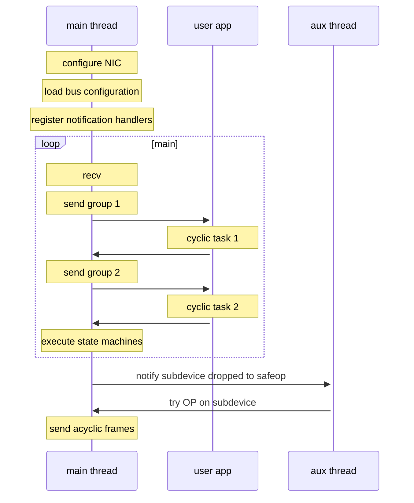
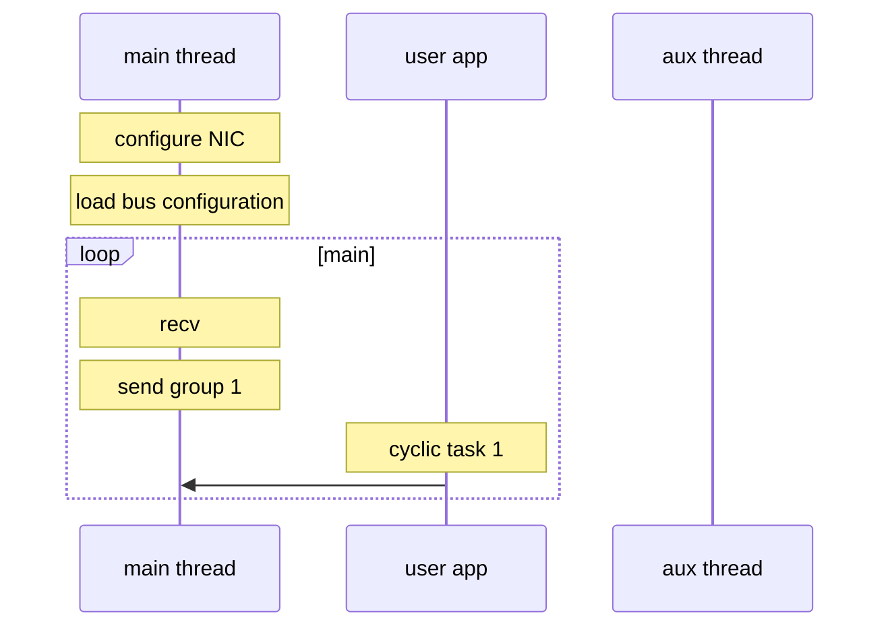

# API Design

## Threading

```mermaid
sequenceDiagram;
    participant main thread;
    participant user app;
    participant aux thread;
    

    note over main thread: configure NIC
    note over main thread: load bus configuration
    note over main thread: register notification handlers

    loop main
        note over main thread: recv
        note over main thread: send group 1
        main thread ->>+ user app: 
        note over user app: cyclic task 1
        user app ->> main thread: 

        note over main thread: send group 2
        main thread ->>+ user app: 
        note over user app: cyclic task 2
        user app ->> main thread: 
        note over main thread: execute state machines
    end
    main thread ->>+ aux thread: notify subdevice dropped to safeop 
    aux thread ->> main thread: try OP on subdevice
    note over main thread: send acyclic frames
    
```

Pros:

1. Most of the complexity is in the bus configuration.

Cons:

1. Lots of different notifications. Difficult to handle all failure modes.

## Async

```mermaid
sequenceDiagram;
    participant main thread;
    participant user app;
    participant aux thread;

    note over main thread: configure NIC
    note over main thread: load bus configuration
    

    loop main
        note over main thread: recv
        note over main thread: send group 1
        note over user app: cyclic task 1
        user app ->> main thread: 

    end

```
