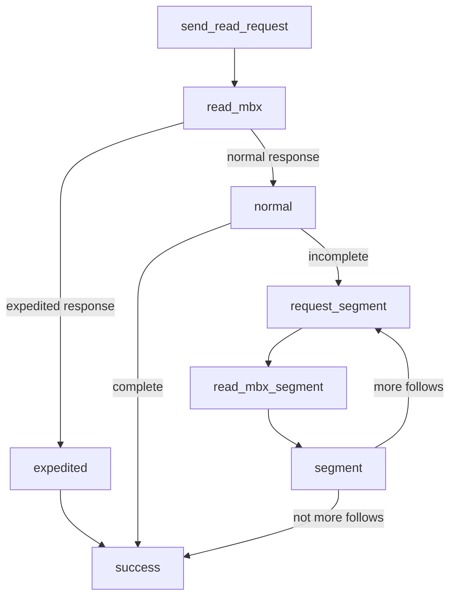
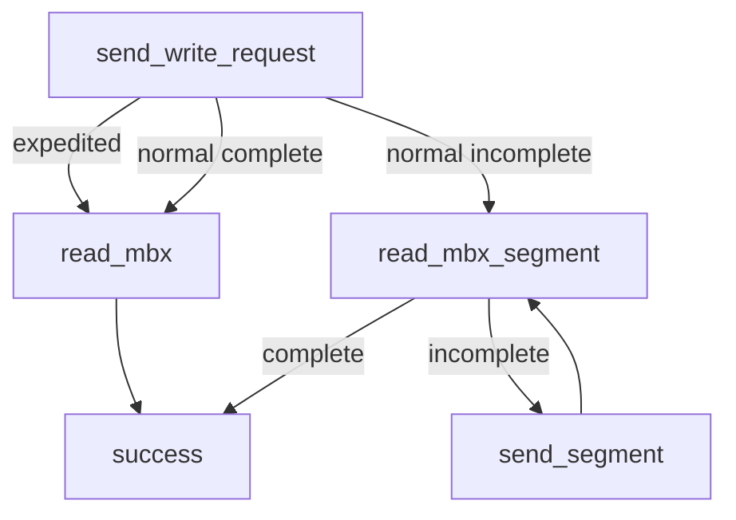

# Mailbox Design

## CoE

### SDO Read State Machiine

> Ref: IEC 61158-5-12:2019 6.1.4.1.3 SDO Interactions

Repeat requests are not implemented for simplicity.

```mermaid
graph TB;
    send_read_request --> read_mbx;
    read_mbx -->|expedited response| expedited;
    expedited --> success;
    read_mbx -->|normal response| normal;
    normal --> |complete| success;
    normal --> |incomplete| request_segment
    request_segment --> read_mbx_segment;
    read_mbx_segment --> segment;
    segment -->|not more follows| success;
    segment -->|more follows| request_segment; 
```

### SDO Write State Machine

```mermaid
graph TB;  
    send_write_request -->|expedited| read_mbx;
    send_write_request -->|normal complete| read_mbx;
    read_mbx --> success;
    send_write_request -->|normal incomplete| read_mbx_segment;
    read_mbx_segment -->|incomplete| send_segment;
    read_mbx_segment -->|complete|success;
    send_segment --> read_mbx_segment;

```
